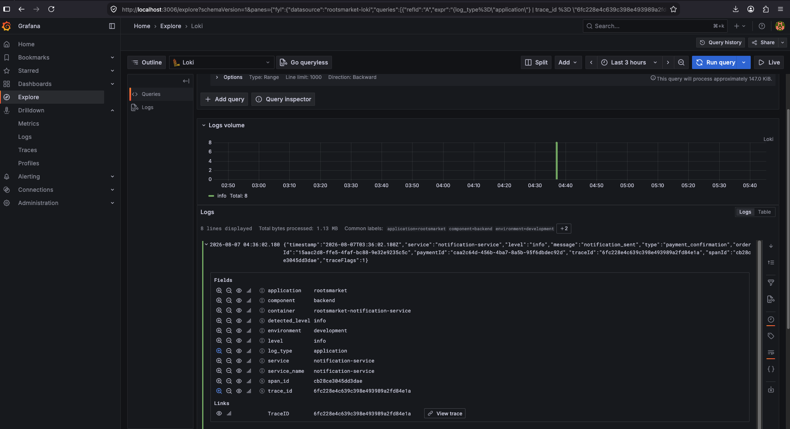
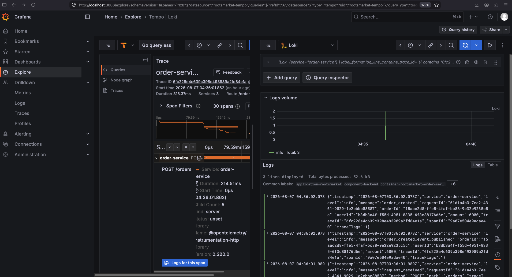
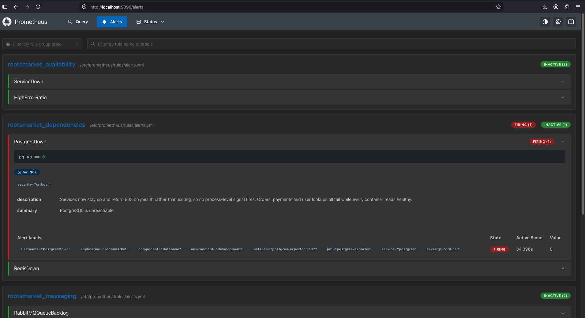
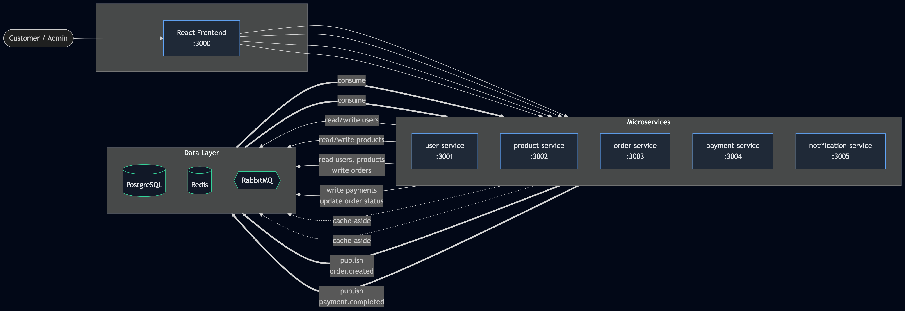

# 🌱 RootsMarket


A cloud-native microservices platform simulating an online African grocery
marketplace — five Node.js services, event-driven over RabbitMQ, with a full
observability stack and an end-to-end suite that verifies it.

## One order, one trace

A single `POST /orders` produces one distributed trace spanning three services
and two message-broker hops:


```
order-service  POST /orders
  ├─ pg  BEGIN → SELECT → INSERT → UPDATE → COMMIT
  └─ default publish order.created
       └─ payment-service  order.created process
            ├─ pg  BEGIN → SELECT → INSERT → UPDATE → COMMIT
            └─ default publish payment.completed
                 └─ notification-service  payment.completed process
```

Trace context does not cross a broker on its own. Order-service injects the
W3C `traceparent` into the AMQP headers; each consumer extracts it and starts
its span beneath the producer's. Without that, every service begins a new root
trace and the picture above is three disconnected fragments.

## Logs and traces are linked, both directions

Every log line carries a valid `trace_id` as Loki **structured metadata** —
attached to the entry rather than parsed from the line, so it costs no label
cardinality and the Grafana derived field matches on it directly.

| Log → Trace | Trace → Logs |
|---|---|
|  |  |

Click a log line, land on its trace. Open a span, land on its logs, scoped to
that service.

## Dashboards and alerting


Four dashboards — application, infrastructure, host, containers — plus 10 alert
rules and 15 recording rules as version-controlled Prometheus config.



`PostgresDown` fires on `pg_up == 0` rather than `up == 0`, because the
exporter stays up and returns 200 while its backend is gone.

## Verified, not assumed

```
$ ./scripts/e2e-test.sh --with-failure
...
19 passed, 0 failed
```

[`scripts/e2e-test.sh`](scripts/e2e-test.sh) runs 19 checks against the live
stack. Each one asserts a specific failure this project actually hit:

| # | Check |
|---|---|
| 4 | Malformed UUID returns 400, not 500 |
| 6 | One trace ID across two broker hops |
| 8 | `trace_id` present as Loki structured metadata |
| 9 | No all-zero trace IDs in logs |
| 10 | Health checks create no orphan root traces |
| 11 | App shutdown logs *before* the SDK flush, not merely alongside it |
| 12 | `--with-failure`: Postgres down → 503, alert active, recovery |

Full output: [`docs/e2e-output.txt`](docs/e2e-output.txt)

## What broke, and why

[**`RUNTIME-FINDINGS.md`**](RUNTIME-FINDINGS.md) is the most useful document
here. A sample of what the stack surfaced once it could see itself:

- **Healthchecks that could never pass.** Tempo and the OTel collector ship as
  distroless and `scratch` images — no shell, no `wget`. The whole stack
  blocked on `service_healthy` conditions that would never arrive.
- **Spans dropped on every deploy.** The app's shutdown handler and the SDK's
  raced to `process.exit(0)`; closing a channel is faster than an HTTP export,
  so the app always won and the buffered spans died with it.
- **Route cardinality.** `req.path` as a metric label minted a Prometheus time
  series per order id. Fixed to `req.route.path`, with `unmatched` for 404s.
- **Silent consumer death.** `amqplib` emits `'error'`; an EventEmitter with no
  listener kills the process. Consumers never reconnected after a broker
  restart while `/health` still returned 200 — messages piling up, everything
  green.
- **An alerting blind spot that only appeared after a fix.** `ServiceDown` had
  been firing during outages — but it was detecting the crash loop, not the
  database. Once services survived and reported 503 honestly, nothing alerted
  at all.

## Architecture



Five services, each owning its own writes. Order creation is synchronous to
the HTTP response and asynchronous after it: `order.created` and
`payment.completed` carry the flow through RabbitMQ.

Note that the three signals take three different paths — only traces go
through the OpenTelemetry Collector:

```
traces   services ──OTLP/http── otel-collector ──OTLP/grpc──▶ Tempo
logs     services ──stdout──── Docker ──socket── Alloy ──push── Loki
metrics  services ──/metrics── scraped by Prometheus
```

Detail in [docs/architecture.md](docs/architecture.md).

## Technology

| Layer | Technology |
|--------|------------|
| Frontend | React, Vite |
| Backend | Node.js 20, Express 5 |
| Database | PostgreSQL |
| Cache | Redis |
| Messaging | RabbitMQ (amqplib) |
| Containers | Docker Compose (npm workspaces monorepo) |
| Traces | OpenTelemetry → Collector → Tempo |
| Logs | Alloy → Loki |
| Metrics | prom-client → Prometheus |
| Dashboards | Grafana |
| Next | Kubernetes, GitOps |

## Quick start

```bash
git clone https://github.com/<your-username>/RootsMarket.git
cd RootsMarket
cp .env.example .env
docker compose up -d --build
```

Wait for RabbitMQ (90s cold start), then verify:

```bash
./scripts/e2e-test.sh
```

| Component | URL |
|-----------|-----|
| Storefront | http://localhost:3000 |
| Grafana | http://localhost:3006 |
| Prometheus | http://localhost:9090 |
| Tempo | http://localhost:3200 |
| RabbitMQ Management | http://localhost:15672 |

## Documentation

| Document | Contents |
|---|---|
| [RUNTIME-FINDINGS.md](RUNTIME-FINDINGS.md) | Bugs found by the stack, and the reasoning behind each fix |
| [docs/architecture.md](docs/architecture.md) | Service boundaries and event flow |
| [docs/observability.md](docs/observability.md) | Instrumentation, correlation, alert rules |
| [docs/decisions.md](docs/decisions.md) | Engineering trade-offs |

## Roadmap

- [x] Microservices with event-driven messaging
- [x] Distributed tracing across RabbitMQ
- [x] Log ↔ trace correlation
- [x] Dashboards, alerting, recording rules
- [x] End-to-end verification suite
- [ ] Kubernetes migration
- [ ] GitOps delivery